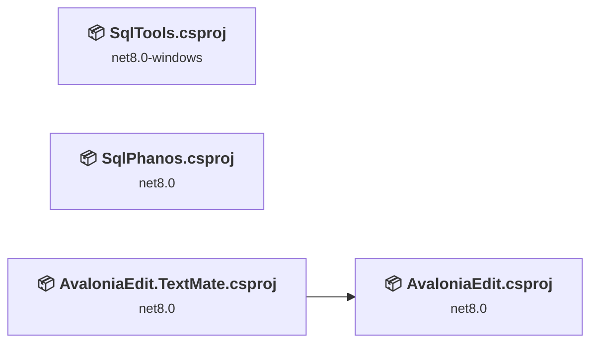
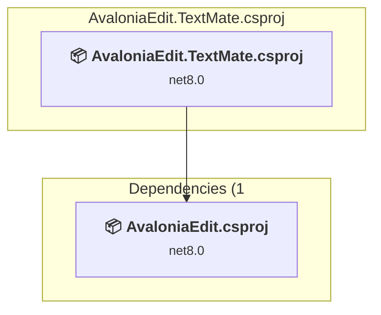
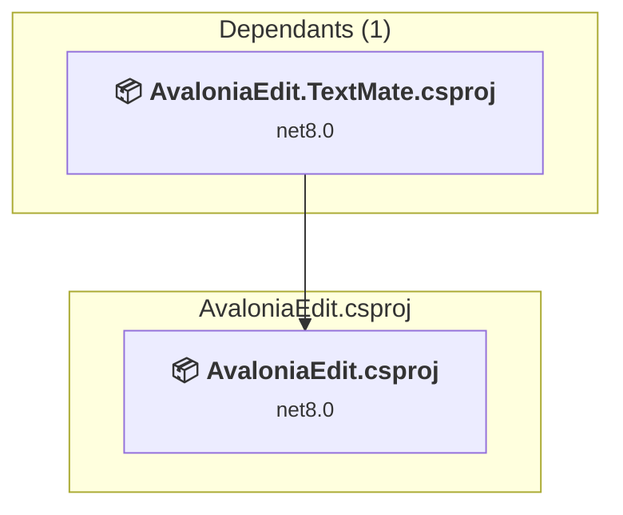
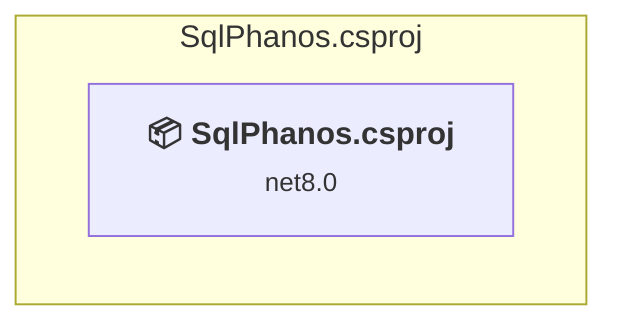
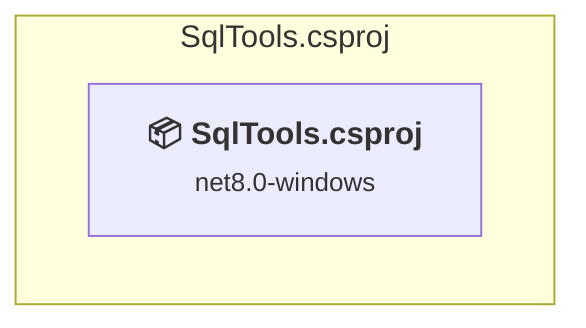

# Projects and dependencies analysis

This document provides a comprehensive overview of the projects and their dependencies in the context of upgrading to .NETCoreApp,Version=v10.0.

## Table of Contents

- [Executive Summary](#executive-Summary)
  - [Highlevel Metrics](#highlevel-metrics)
  - [Projects Compatibility](#projects-compatibility)
  - [Package Compatibility](#package-compatibility)
  - [API Compatibility](#api-compatibility)
- [Aggregate NuGet packages details](#aggregate-nuget-packages-details)
- [Top API Migration Challenges](#top-api-migration-challenges)
  - [Technologies and Features](#technologies-and-features)
  - [Most Frequent API Issues](#most-frequent-api-issues)
- [Projects Relationship Graph](#projects-relationship-graph)
- [Project Details](#project-details)

  - [external\AvaloniaEdit\src\AvaloniaEdit.TextMate\AvaloniaEdit.TextMate.csproj](#externalavaloniaeditsrcavaloniaedittextmateavaloniaedittextmatecsproj)
  - [external\AvaloniaEdit\src\AvaloniaEdit\AvaloniaEdit.csproj](#externalavaloniaeditsrcavaloniaeditavaloniaeditcsproj)
  - [SqlPhanos\SqlPhanos.csproj](#sqlphanossqlphanoscsproj)
  - [SqlTools\SqlTools.csproj](#sqltoolssqltoolscsproj)

## Executive Summary

### Highlevel Metrics

| Metric | Count | Status |
| :--- | :---: | :--- |
| Total Projects | 4 | All require upgrade |
| Total NuGet Packages | 63 | 3 need upgrade |
| Total Code Files | 287 |  |
| Total Code Files with Incidents | 50 |  |
| Total Lines of Code | 52632 |  |
| Total Number of Issues | 1792 |  |
| Estimated LOC to modify | 1785+ | at least 3.4% of codebase |

### Projects Compatibility

| Project | Target Framework | Difficulty | Package Issues | API Issues | Est. LOC Impact | Description |
| :--- | :---: | :---: | :---: | :---: | :---: | :--- |
| [external\AvaloniaEdit\src\AvaloniaEdit.TextMate\AvaloniaEdit.TextMate.csproj](#externalavaloniaeditsrcavaloniaedittextmateavaloniaedittextmatecsproj) | net8.0 | 🟢 Low | 0 | 0 |  | ClassLibrary, Sdk Style = True |
| [external\AvaloniaEdit\src\AvaloniaEdit\AvaloniaEdit.csproj](#externalavaloniaeditsrcavaloniaeditavaloniaeditcsproj) | net8.0 | 🟢 Low | 0 | 27 | 27+ | ClassLibrary, Sdk Style = True |
| [SqlPhanos\SqlPhanos.csproj](#sqlphanossqlphanoscsproj) | net8.0 | 🟢 Low | 0 | 2 | 2+ | WinForms, Sdk Style = True |
| [SqlTools\SqlTools.csproj](#sqltoolssqltoolscsproj) | net8.0-windows | 🟡 Medium | 3 | 1756 | 1756+ | Wpf, Sdk Style = True |

### Package Compatibility

| Status | Count | Percentage |
| :--- | :---: | :---: |
| ✅ Compatible | 60 | 95.2% |
| ⚠️ Incompatible | 3 | 4.8% |
| 🔄 Upgrade Recommended | 0 | 0.0% |
| ***Total NuGet Packages*** | ***63*** | ***100%*** |

### API Compatibility

| Category | Count | Impact |
| :--- | :---: | :--- |
| 🔴 Binary Incompatible | 1604 | High - Require code changes |
| 🟡 Source Incompatible | 125 | Medium - Needs re-compilation and potential conflicting API error fixing |
| 🔵 Behavioral change | 56 | Low - Behavioral changes that may require testing at runtime |
| ✅ Compatible | 33084 |  |
| ***Total APIs Analyzed*** | ***34869*** |  |

## Aggregate NuGet packages details

| Package | Current Version | Suggested Version | Projects | Description |
| :--- | :---: | :---: | :--- | :--- |
| AvalonEdit | 6.3.1.120 | 6.2.0.78 | [SqlTools.csproj](#sqltoolssqltoolscsproj) | ⚠️NuGet package is incompatible |
| Avalonia | 12.0.3 |  | [AvaloniaEdit.csproj](#externalavaloniaeditsrcavaloniaeditavaloniaeditcsproj) [AvaloniaEdit.TextMate.csproj](#externalavaloniaeditsrcavaloniaedittextmateavaloniaedittextmatecsproj) [SqlPhanos.csproj](#sqlphanossqlphanoscsproj) | ✅Compatible |
| Avalonia.Controls.DataGrid | 12.0.3 |  | [SqlPhanos.csproj](#sqlphanossqlphanoscsproj) | ✅Compatible |
| Avalonia.Desktop | 12.0.3 |  | [SqlPhanos.csproj](#sqlphanossqlphanoscsproj) | ✅Compatible |
| Avalonia.Diagnostics | 12.0.3 |  | [SqlPhanos.csproj](#sqlphanossqlphanoscsproj) | ✅Compatible |
| Avalonia.Fonts.Inter | 12.0.3 |  | [SqlPhanos.csproj](#sqlphanossqlphanoscsproj) | ✅Compatible |
| Avalonia.ReactiveUI | 12.0.3 |  | [SqlPhanos.csproj](#sqlphanossqlphanoscsproj) | ✅Compatible |
| Avalonia.Themes.Fluent | 12.0.3 |  | [SqlPhanos.csproj](#sqlphanossqlphanoscsproj) | ✅Compatible |
| Azure.Core | 1.57.0 |  | [SqlTools.csproj](#sqltoolssqltoolscsproj) | ✅Compatible |
| Azure.Identity | 1.21.0 |  | [SqlTools.csproj](#sqltoolssqltoolscsproj) | ✅Compatible |
| Caliburn.Micro | 5.0.258 | 4.0.230 | [SqlTools.csproj](#sqltoolssqltoolscsproj) | ⚠️NuGet package is incompatible |
| Caliburn.Micro.Core | 5.0.258 |  | [SqlTools.csproj](#sqltoolssqltoolscsproj) | ✅Compatible |
| CommunityToolkit.Mvvm | 8.4.2 |  | [SqlPhanos.csproj](#sqlphanossqlphanoscsproj) | ✅Compatible |
| Dock.Avalonia | 12.0.0.2 |  | [SqlPhanos.csproj](#sqlphanossqlphanoscsproj) | ✅Compatible |
| Dock.Model.Avalonia | 12.0.0.2 |  | [SqlPhanos.csproj](#sqlphanossqlphanoscsproj) | ✅Compatible |
| Dock.Model.Mvvm | 12.0.0.2 |  | [SqlPhanos.csproj](#sqlphanossqlphanoscsproj) | ✅Compatible |
| Fody | 6.9.3 |  | [SqlTools.csproj](#sqltoolssqltoolscsproj) | ✅Compatible |
| LinqKit | 1.3.11 |  | [SqlTools.csproj](#sqltoolssqltoolscsproj) | ✅Compatible |
| LinqKit.Core | 1.2.11 |  | [SqlTools.csproj](#sqltoolssqltoolscsproj) | ✅Compatible |
| Microsoft.Bcl.AsyncInterfaces | 10.0.8 |  | [SqlTools.csproj](#sqltoolssqltoolscsproj) | ✅Compatible |
| Microsoft.Bcl.HashCode | 6.0.0 |  | [SqlTools.csproj](#sqltoolssqltoolscsproj) | ✅Compatible |
| Microsoft.Bcl.TimeProvider | 10.0.8 |  | [SqlTools.csproj](#sqltoolssqltoolscsproj) | ✅Compatible |
| Microsoft.Data.SqlClient | 7.0.1 |  | [SqlPhanos.csproj](#sqlphanossqlphanoscsproj) [SqlTools.csproj](#sqltoolssqltoolscsproj) | ✅Compatible |
| Microsoft.Extensions.DependencyInjection.Abstractions | 10.0.8 |  | [SqlTools.csproj](#sqltoolssqltoolscsproj) | ✅Compatible |
| Microsoft.Extensions.Logging.Abstractions | 10.0.8 |  | [SqlTools.csproj](#sqltoolssqltoolscsproj) | ✅Compatible |
| Microsoft.Extensions.Options | 10.0.8 |  | [SqlTools.csproj](#sqltoolssqltoolscsproj) | ✅Compatible |
| Microsoft.Extensions.Primitives | 10.0.8 |  | [SqlTools.csproj](#sqltoolssqltoolscsproj) | ✅Compatible |
| Microsoft.Identity.Client | 4.84.1 |  | [SqlTools.csproj](#sqltoolssqltoolscsproj) | ✅Compatible |
| Microsoft.Identity.Client.Extensions.Msal | 4.84.1 |  | [SqlTools.csproj](#sqltoolssqltoolscsproj) | ✅Compatible |
| Microsoft.IdentityModel.Abstractions | 8.18.0 |  | [SqlTools.csproj](#sqltoolssqltoolscsproj) | ✅Compatible |
| Microsoft.IdentityModel.JsonWebTokens | 8.18.0 |  | [SqlTools.csproj](#sqltoolssqltoolscsproj) | ✅Compatible |
| Microsoft.IdentityModel.Logging | 8.18.0 |  | [SqlTools.csproj](#sqltoolssqltoolscsproj) | ✅Compatible |
| Microsoft.IdentityModel.Protocols | 8.18.0 |  | [SqlTools.csproj](#sqltoolssqltoolscsproj) | ✅Compatible |
| Microsoft.IdentityModel.Protocols.OpenIdConnect | 8.18.0 |  | [SqlTools.csproj](#sqltoolssqltoolscsproj) | ✅Compatible |
| Microsoft.IdentityModel.Tokens | 8.18.0 |  | [SqlTools.csproj](#sqltoolssqltoolscsproj) | ✅Compatible |
| Microsoft.SourceLink.GitHub | 10.0.300 |  | [AvaloniaEdit.csproj](#externalavaloniaeditsrcavaloniaeditavaloniaeditcsproj) [AvaloniaEdit.TextMate.csproj](#externalavaloniaeditsrcavaloniaedittextmateavaloniaedittextmatecsproj) | ✅Compatible |
| Microsoft.SqlServer.SqlManagementObjects | 181.19.0 |  | [SqlPhanos.csproj](#sqlphanossqlphanoscsproj) [SqlTools.csproj](#sqltoolssqltoolscsproj) | ✅Compatible |
| Microsoft.SqlServer.TransactSql.ScriptDom | 180.18.1 |  | [SqlTools.csproj](#sqltoolssqltoolscsproj) | ✅Compatible |
| Microsoft.Xaml.Behaviors.Wpf | 1.1.142 | 1.1.39 | [SqlTools.csproj](#sqltoolssqltoolscsproj) | ⚠️NuGet package is incompatible |
| Newtonsoft.Json | 13.0.4 |  | [SqlTools.csproj](#sqltoolssqltoolscsproj) | ✅Compatible |
| Projektanker.Icons.Avalonia | 9.6.2 |  | [SqlPhanos.csproj](#sqlphanossqlphanoscsproj) | ✅Compatible |
| Projektanker.Icons.Avalonia.FontAwesome | 9.6.2 |  | [SqlPhanos.csproj](#sqlphanossqlphanoscsproj) | ✅Compatible |
| PropertyChanged.Fody | 4.1.0 |  | [SqlTools.csproj](#sqltoolssqltoolscsproj) | ✅Compatible |
| System.ClientModel | 1.13.0 |  | [SqlTools.csproj](#sqltoolssqltoolscsproj) | ✅Compatible |
| System.ComponentModel.Composition | 10.0.8 |  | [SqlTools.csproj](#sqltoolssqltoolscsproj) | ✅Compatible |
| System.Configuration.ConfigurationManager | 10.0.8 |  | [SqlTools.csproj](#sqltoolssqltoolscsproj) | ✅Compatible |
| System.Diagnostics.DiagnosticSource | 10.0.8 |  | [SqlTools.csproj](#sqltoolssqltoolscsproj) | ✅Compatible |
| System.IdentityModel.Tokens.Jwt | 8.18.0 |  | [SqlTools.csproj](#sqltoolssqltoolscsproj) | ✅Compatible |
| System.IO.Pipelines | 10.0.8 |  | [SqlTools.csproj](#sqltoolssqltoolscsproj) | ✅Compatible |
| System.Memory.Data | 10.0.8 |  | [SqlTools.csproj](#sqltoolssqltoolscsproj) | ✅Compatible |
| System.Reactive | 6.1.0 |  | [SqlTools.csproj](#sqltoolssqltoolscsproj) | ✅Compatible |
| System.Reactive.Core | 6.1.0 |  | [SqlTools.csproj](#sqltoolssqltoolscsproj) | ✅Compatible |
| System.Reactive.Interfaces | 6.1.0 |  | [SqlTools.csproj](#sqltoolssqltoolscsproj) | ✅Compatible |
| System.Reactive.Linq | 6.1.0 |  | [SqlTools.csproj](#sqltoolssqltoolscsproj) | ✅Compatible |
| System.Reactive.PlatformServices | 6.1.0 |  | [SqlTools.csproj](#sqltoolssqltoolscsproj) | ✅Compatible |
| System.Runtime.CompilerServices.Unsafe | 6.1.2 |  | [SqlTools.csproj](#sqltoolssqltoolscsproj) | ✅Compatible |
| System.Security.AccessControl | 6.0.1 |  | [SqlTools.csproj](#sqltoolssqltoolscsproj) | ✅Compatible |
| System.Security.Cryptography.ProtectedData | 10.0.8 |  | [SqlTools.csproj](#sqltoolssqltoolscsproj) | ✅Compatible |
| System.Security.Permissions | 10.0.8 |  | [SqlTools.csproj](#sqltoolssqltoolscsproj) | ✅Compatible |
| System.Text.Encodings.Web | 10.0.8 |  | [SqlTools.csproj](#sqltoolssqltoolscsproj) | ✅Compatible |
| System.Text.Json | 10.0.8 |  | [SqlTools.csproj](#sqltoolssqltoolscsproj) | ✅Compatible |
| TextMateSharp | 2.0.3 |  | [AvaloniaEdit.TextMate.csproj](#externalavaloniaeditsrcavaloniaedittextmateavaloniaedittextmatecsproj) | ✅Compatible |
| TextMateSharp.Grammars | 2.0.3 |  | [AvaloniaEdit.TextMate.csproj](#externalavaloniaeditsrcavaloniaedittextmateavaloniaedittextmatecsproj) | ✅Compatible |

## Top API Migration Challenges

### Technologies and Features

| Technology | Issues | Percentage | Migration Path |
| :--- | :---: | :---: | :--- |
| WPF (Windows Presentation Foundation) | 906 | 50.8% | WPF APIs for building Windows desktop applications with XAML-based UI that are available in .NET on Windows. WPF provides rich desktop UI capabilities with data binding and styling. Enable Windows Desktop support: Option 1 (Recommended): Target net9.0-windows; Option 2: Add <UseWindowsDesktop>true</UseWindowsDesktop>. |
| Legacy Configuration System | 2 | 0.1% | Legacy XML-based configuration system (app.config/web.config) that has been replaced by a more flexible configuration model in .NET Core. The old system was rigid and XML-based. Migrate to Microsoft.Extensions.Configuration with JSON/environment variables; use System.Configuration.ConfigurationManager NuGet package as interim bridge if needed. |

### Most Frequent API Issues

| API | Count | Percentage | Category |
| :--- | :---: | :---: | :--- |
| T:System.Windows.DependencyProperty | 186 | 10.4% | Binary Incompatible |
| T:System.Windows.Controls.TextBox | 62 | 3.5% | Binary Incompatible |
| M:System.Windows.DependencyObject.SetValue(System.Windows.DependencyProperty,System.Object) | 56 | 3.1% | Binary Incompatible |
| T:System.Windows.Media.FontFamily | 55 | 3.1% | Binary Incompatible |
| M:System.Windows.DependencyObject.GetValue(System.Windows.DependencyProperty) | 54 | 3.0% | Binary Incompatible |
| T:System.Windows.Controls.ListBox | 43 | 2.4% | Binary Incompatible |
| T:System.Uri | 39 | 2.2% | Behavioral Change |
| T:System.Windows.RoutedEventHandler | 30 | 1.7% | Binary Incompatible |
| T:System.Windows.Controls.CheckBox | 26 | 1.5% | Binary Incompatible |
| T:System.Windows.FontStyle | 22 | 1.2% | Binary Incompatible |
| T:System.Windows.FontStretch | 21 | 1.2% | Binary Incompatible |
| T:System.Windows.Controls.Grid | 19 | 1.1% | Binary Incompatible |
| T:System.Windows.FontWeight | 19 | 1.1% | Binary Incompatible |
| T:System.Windows.GridLength | 17 | 1.0% | Binary Incompatible |
| T:System.Windows.Media.Brush | 17 | 1.0% | Binary Incompatible |
| T:System.Windows.Documents.Run | 15 | 0.8% | Binary Incompatible |
| T:System.Windows.Controls.ItemCollection | 15 | 0.8% | Binary Incompatible |
| P:System.Windows.Controls.ItemsControl.Items | 15 | 0.8% | Binary Incompatible |
| T:System.Windows.Application | 14 | 0.8% | Binary Incompatible |
| M:System.Windows.Controls.UserControl.#ctor | 14 | 0.8% | Binary Incompatible |
| P:System.Windows.Controls.TextBox.Text | 14 | 0.8% | Binary Incompatible |
| T:System.Windows.Controls.Button | 14 | 0.8% | Binary Incompatible |
| T:System.Windows.Controls.TextBlock | 14 | 0.8% | Binary Incompatible |
| T:System.Windows.Thickness | 14 | 0.8% | Binary Incompatible |
| T:System.Windows.Controls.TabItem | 13 | 0.7% | Binary Incompatible |
| P:System.Windows.Controls.Primitives.Selector.SelectedItem | 13 | 0.7% | Binary Incompatible |
| M:System.Uri.#ctor(System.String,System.UriKind) | 12 | 0.7% | Behavioral Change |
| M:System.Windows.Application.LoadComponent(System.Object,System.Uri) | 11 | 0.6% | Binary Incompatible |
| T:System.Windows.Media.Typeface | 11 | 0.6% | Binary Incompatible |
| T:System.ComponentModel.Composition.Hosting.CompositionContainer | 11 | 0.6% | Source Incompatible |
| T:System.Windows.Markup.IComponentConnector | 10 | 0.6% | Binary Incompatible |
| T:System.Windows.DependencyObject | 10 | 0.6% | Binary Incompatible |
| T:System.Windows.Controls.TabControl | 10 | 0.6% | Binary Incompatible |
| T:System.Windows.Controls.RichTextBox | 10 | 0.6% | Binary Incompatible |
| T:System.Windows.TextDecorationCollection | 10 | 0.6% | Binary Incompatible |
| P:System.Windows.Controls.Primitives.ToggleButton.IsChecked | 10 | 0.6% | Binary Incompatible |
| T:System.Windows.Controls.SelectionChangedEventHandler | 10 | 0.6% | Binary Incompatible |
| T:System.Windows.Media.SolidColorBrush | 9 | 0.5% | Binary Incompatible |
| P:System.Windows.Controls.TextBlock.Text | 9 | 0.5% | Binary Incompatible |
| T:System.Windows.Markup.XmlLanguage | 9 | 0.5% | Binary Incompatible |
| T:System.Windows.TextDecorationLocation | 9 | 0.5% | Binary Incompatible |
| T:System.Windows.Controls.ContentControl | 8 | 0.4% | Binary Incompatible |
| T:System.Windows.Controls.UserControl | 8 | 0.4% | Binary Incompatible |
| M:System.Windows.Controls.TextBlock.#ctor | 8 | 0.4% | Binary Incompatible |
| T:System.Windows.Documents.TextPointer | 8 | 0.4% | Binary Incompatible |
| T:System.Windows.Input.Key | 8 | 0.4% | Binary Incompatible |
| T:System.Windows.PropertyMetadata | 8 | 0.4% | Binary Incompatible |
| T:System.Windows.Documents.FlowDocument | 8 | 0.4% | Binary Incompatible |
| M:System.Windows.Documents.Run.#ctor(System.String) | 8 | 0.4% | Binary Incompatible |
| T:System.Windows.Input.KeyEventHandler | 8 | 0.4% | Binary Incompatible |

## Projects Relationship Graph

Legend:
📦 SDK-style project
⚙️ Classic project

## Project Details

### external\AvaloniaEdit\src\AvaloniaEdit.TextMate\AvaloniaEdit.TextMate.csproj

#### Project Info

- **Current Target Framework:** net8.0
- **Proposed Target Framework:** net10.0
- **SDK-style**: True
- **Project Kind:** ClassLibrary
- **Dependencies**: 1
- **Dependants**: 0
- **Number of Files**: 8
- **Number of Files with Incidents**: 1
- **Lines of Code**: 1015
- **Estimated LOC to modify**: 0+ (at least 0.0% of the project)

#### Dependency Graph

Legend:
📦 SDK-style project
⚙️ Classic project

### API Compatibility

| Category | Count | Impact |
| :--- | :---: | :--- |
| 🔴 Binary Incompatible | 0 | High - Require code changes |
| 🟡 Source Incompatible | 0 | Medium - Needs re-compilation and potential conflicting API error fixing |
| 🔵 Behavioral change | 0 | Low - Behavioral changes that may require testing at runtime |
| ✅ Compatible | 657 |  |
| ***Total APIs Analyzed*** | ***657*** |  |

### external\AvaloniaEdit\src\AvaloniaEdit\AvaloniaEdit.csproj

#### Project Info

- **Current Target Framework:** net8.0
- **Proposed Target Framework:** net10.0
- **SDK-style**: True
- **Project Kind:** ClassLibrary
- **Dependencies**: 0
- **Dependants**: 1
- **Number of Files**: 231
- **Number of Files with Incidents**: 6
- **Lines of Code**: 44084
- **Estimated LOC to modify**: 27+ (at least 0.1% of the project)

#### Dependency Graph

Legend:
📦 SDK-style project
⚙️ Classic project

### API Compatibility

| Category | Count | Impact |
| :--- | :---: | :--- |
| 🔴 Binary Incompatible | 0 | High - Require code changes |
| 🟡 Source Incompatible | 1 | Medium - Needs re-compilation and potential conflicting API error fixing |
| 🔵 Behavioral change | 26 | Low - Behavioral changes that may require testing at runtime |
| ✅ Compatible | 24970 |  |
| ***Total APIs Analyzed*** | ***24997*** |  |

### SqlPhanos\SqlPhanos.csproj

#### Project Info

- **Current Target Framework:** net8.0
- **Proposed Target Framework:** net10.0-windows
- **SDK-style**: True
- **Project Kind:** WinForms
- **Dependencies**: 0
- **Dependants**: 0
- **Number of Files**: 22
- **Number of Files with Incidents**: 2
- **Lines of Code**: 1251
- **Estimated LOC to modify**: 2+ (at least 0.2% of the project)

#### Dependency Graph

Legend:
📦 SDK-style project
⚙️ Classic project

### API Compatibility

| Category | Count | Impact |
| :--- | :---: | :--- |
| 🔴 Binary Incompatible | 0 | High - Require code changes |
| 🟡 Source Incompatible | 2 | Medium - Needs re-compilation and potential conflicting API error fixing |
| 🔵 Behavioral change | 0 | Low - Behavioral changes that may require testing at runtime |
| ✅ Compatible | 2423 |  |
| ***Total APIs Analyzed*** | ***2425*** |  |

### SqlTools\SqlTools.csproj

#### Project Info

- **Current Target Framework:** net8.0-windows
- **Proposed Target Framework:** net10.0-windows
- **SDK-style**: True
- **Project Kind:** Wpf
- **Dependencies**: 0
- **Dependants**: 0
- **Number of Files**: 50
- **Number of Files with Incidents**: 41
- **Lines of Code**: 6282
- **Estimated LOC to modify**: 1756+ (at least 28.0% of the project)

#### Dependency Graph

Legend:
📦 SDK-style project
⚙️ Classic project

### API Compatibility

| Category | Count | Impact |
| :--- | :---: | :--- |
| 🔴 Binary Incompatible | 1604 | High - Require code changes |
| 🟡 Source Incompatible | 122 | Medium - Needs re-compilation and potential conflicting API error fixing |
| 🔵 Behavioral change | 30 | Low - Behavioral changes that may require testing at runtime |
| ✅ Compatible | 5034 |  |
| ***Total APIs Analyzed*** | ***6790*** |  |

#### Project Technologies and Features

| Technology | Issues | Percentage | Migration Path |
| :--- | :---: | :---: | :--- |
| Legacy Configuration System | 2 | 0.1% | Legacy XML-based configuration system (app.config/web.config) that has been replaced by a more flexible configuration model in .NET Core. The old system was rigid and XML-based. Migrate to Microsoft.Extensions.Configuration with JSON/environment variables; use System.Configuration.ConfigurationManager NuGet package as interim bridge if needed. |
| WPF (Windows Presentation Foundation) | 906 | 51.6% | WPF APIs for building Windows desktop applications with XAML-based UI that are available in .NET on Windows. WPF provides rich desktop UI capabilities with data binding and styling. Enable Windows Desktop support: Option 1 (Recommended): Target net9.0-windows; Option 2: Add <UseWindowsDesktop>true</UseWindowsDesktop>. |

